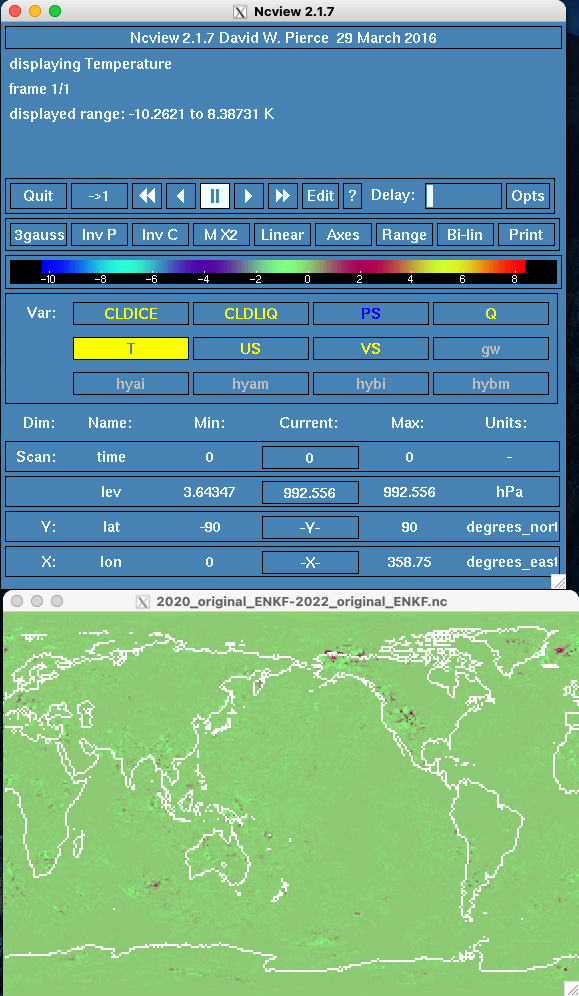

#############################
Testing get_close caching fix
#############################

This page describes a collection of ten three-member CAM-FV runs intended to 
test:

1. The effect of the get_close_caching fix in filter_assim in
   `DART pull request #364 <https://github.com/NCAR/DART/issues/364>`_, and 
2. The effect of the exact second order perturbation sampling ENKF filter
   (ESKF) in ``assimilation_code/modules/assimilation/assim_tools_mod.f90``.

mkmf.template
=============

The ``mkmf.template`` is set for the:

1. Cray wrappers for Intel fortran in both serial and parallel using ``ftn``
2. Serial netcdf
3. No optimization
4. Intel oneAPI Math Kernel Library (oneMKL) using ``qmkl``

.. code-block::

   MPIFC = ftn
   MPILD = ftn
   FC = ftn
   LD = ftn

   INCS = -I/opt/cray/pe/netcdf/4.7.4.4/INTEL/19.1/include
   LIBS = -L/opt/cray/pe/netcdf/4.7.4.4/INTEL/19.1/lib -lnetcdff -lnetcdf

   FFLAGS  = -O0 -qmkl $(INCS)
   LDFLAGS = $(FFLAGS) $(LIBS)

Possible configurations
=======================

There are two DART versions:

1. the ``2020`` version, DART 9.X.X
2. the ``2022`` version, DART 10.5.3

and two statuses of each version:

1. the ``original`` status in which ``assim_tools_mod.f90`` is unchanged, and
2. the ``modified`` status in which ``assim_tools_mod.f90`` has been modified
   to include the ESKF filter.

Thus there are 10 possible configurations of these two statuses, two versions
and three filters:

+------+--------------------+--------------------+--------------------+--------------------+
|      | DART               | DART-esops         | DART_10.5.3        | DART_10.5.3-esops  |
+======+====================+====================+====================+====================+
| EAKF | 2020_original_EAKF | 2020_modified_EAKF | 2022_original_EAKF | 2022_modified_EAKF |
+------+--------------------+--------------------+--------------------+--------------------+
| ENKF | 2020_original_ENKF | 2020_modified_ENKF | 2022_original_ENKF | 2022_original_ENKF |
+------+--------------------+--------------------+--------------------+--------------------+
| ESKF |                    | 2020_modified_ESKF |                    | 2022_modified_ESKF |
+------+--------------------+--------------------+--------------------+--------------------+

It is only possible to build the ESKF filter with the two modified
repositories.

input.nml settings
------------------

+--------+-----------------+------------------+
| Filter | ``filter_kind`` | ``sort_obs_inc`` |
+========+=================+==================+
| EAKF   | ``1``           | ``.false.``      |
+--------+-----------------+------------------+
| ENKF   | ``2``           | ``.true.``       |
+--------+-----------------+------------------+
| ESKF   | ``9``           | ``.true.``       |
+--------+-----------------+------------------+

Differences
===========

There are 13 sensible differences to check between the various repositories:

- Six possible differences between the EAKF experiments
- Six possible differences between the ENKF experiments
- 1 possible difference between the ESKF experiments

EAKF experiments
----------------

All of the EAKF experiments reproduce.

2020_original_EAKF-2020_modified_EAKF
~~~~~~~~~~~~~~~~~~~~~~~~~~~~~~~~~~~~~

|2020_original_EAKF-2020_modified_EAKF|

2020_original_EAKF-2022_original_EAKF
~~~~~~~~~~~~~~~~~~~~~~~~~~~~~~~~~~~~~

|2020_original_EAKF-2022_original_EAKF|

2020_original_EAKF-2022_modified_EAKF
~~~~~~~~~~~~~~~~~~~~~~~~~~~~~~~~~~~~~

|2020_original_EAKF-2022_modified_EAKF|

2020_modified_EAKF-2022_original_EAKF
~~~~~~~~~~~~~~~~~~~~~~~~~~~~~~~~~~~~~

|2020_modified_EAKF-2022_original_EAKF|

2020_modified_EAKF-2022_modified_EAKF
~~~~~~~~~~~~~~~~~~~~~~~~~~~~~~~~~~~~~

|2020_modified_EAKF-2022_modified_EAKF|

2022_original_EAKF-2022_modified_EAKF
~~~~~~~~~~~~~~~~~~~~~~~~~~~~~~~~~~~~~

|2022_original_EAKF-2022_modified_EAKF|

ENKF experiments
----------------

Only two of the ENKF comparisons reproduce:

- the 2020 filters, both original and modified
- the 2022 filters, both original and modified

2020_original_ENKF-2020_modified_ENKF
~~~~~~~~~~~~~~~~~~~~~~~~~~~~~~~~~~~~~

|2020_original_ENKF-2020_modified_ENKF|

2020_original_ENKF-2022_original_ENKF
~~~~~~~~~~~~~~~~~~~~~~~~~~~~~~~~~~~~~

|2020_original_ENKF-2022_original_ENKF|

2020_original_ENKF-2022_modified_ENKF
~~~~~~~~~~~~~~~~~~~~~~~~~~~~~~~~~~~~~

|2020_original_ENKF-2022_modified_ENKF|

2020_modified_ENKF-2022_original_ENKF
~~~~~~~~~~~~~~~~~~~~~~~~~~~~~~~~~~~~~

|2020_modified_ENKF-2022_original_ENKF|

2020_modified_ENKF-2022_modified_ENKF
~~~~~~~~~~~~~~~~~~~~~~~~~~~~~~~~~~~~~

|2020_modified_ENKF-2022_modified_ENKF|

2022_original_ENKF-2022_modified_ENKF
~~~~~~~~~~~~~~~~~~~~~~~~~~~~~~~~~~~~~

|2022_original_ENKF-2022_modified_ENKF|

.. |2020_original_ENKF-2020_modified_ENKF| image:: images/2020_original_ENKF-2020_modified_ENKF.png

ESKF experiments
----------------

The ESKF experiments do not reproduce.

2020_modified_ESKF-2022_modified_ESKF
~~~~~~~~~~~~~~~~~~~~~~~~~~~~~~~~~~~~~

|2020_modified_ESKF-2022_modified_ESKF|

